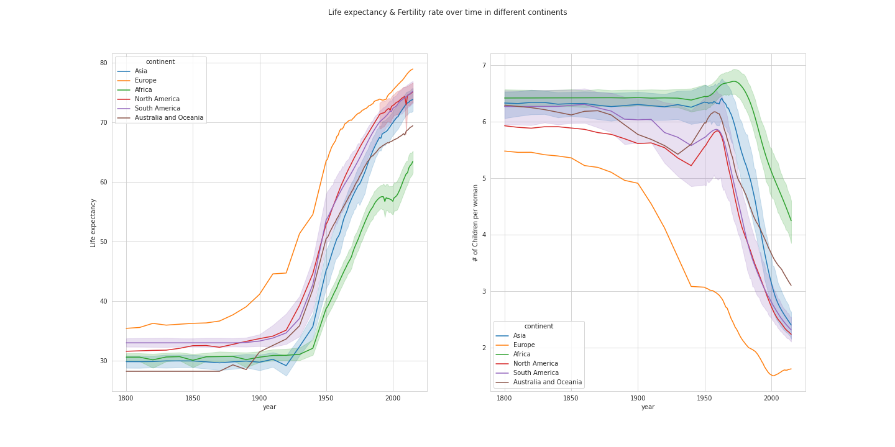
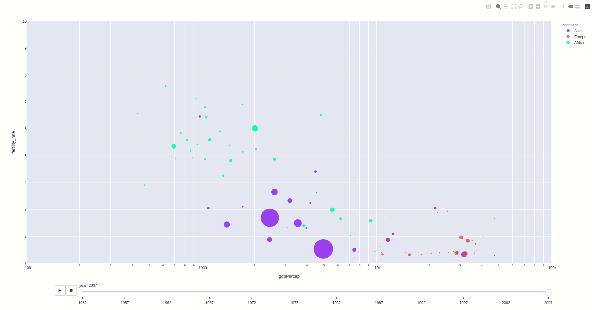
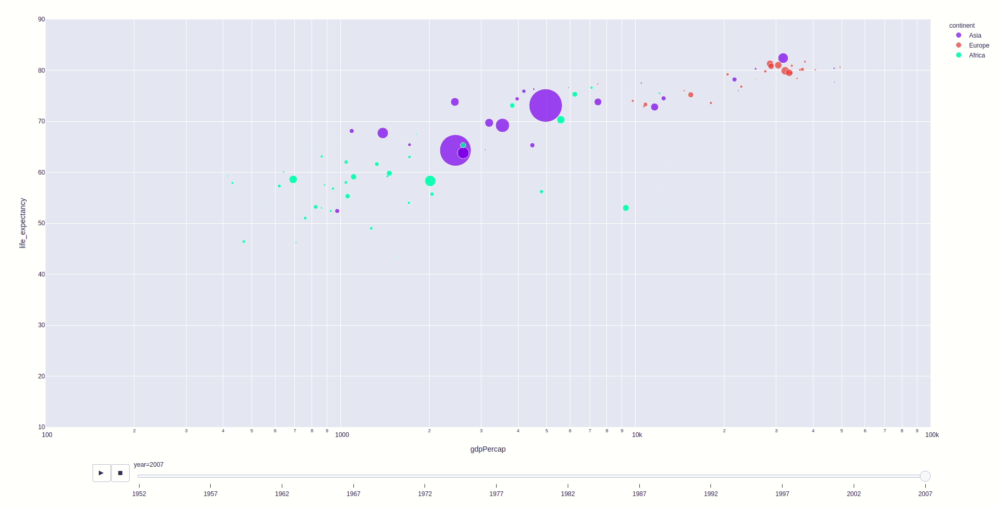

# Week 1 Project: Gapminder

## (Modified) Replication of Gapminder Animation

This project was completed in week 1 of the Data Science Bootcamp at Spiced Academy.

See https://youtu.be/jbkSRLYSojo for the original Gapminder.

Project notebooks are [here](gapminder_final.ipynb) and [here](gapminder_plotly_murat.ipynb)

All the data frames are is publicly available on the [Gapminder project website](https://www.gapminder.org/data/); I also relied on another Gapminder DataFrame that comes with ```plotly_express```

Below is my replication ...


... and here is a static plot showing the trend of life expectancy and fertility (from early 1800s till 2015).



The following is prepped with ```plotly_express``` -- code adopted from https://towardsdatascience.com/recreating-gapminder-animation-in-2-lines-of-python-with-plotly-express-2060c73bedec.

The following plotly animation shows the relationship between GDP per capita and fertility across time in three continents




This following plotly animation shows the relationship between GDP per capita and life expectancy across time in three continents


