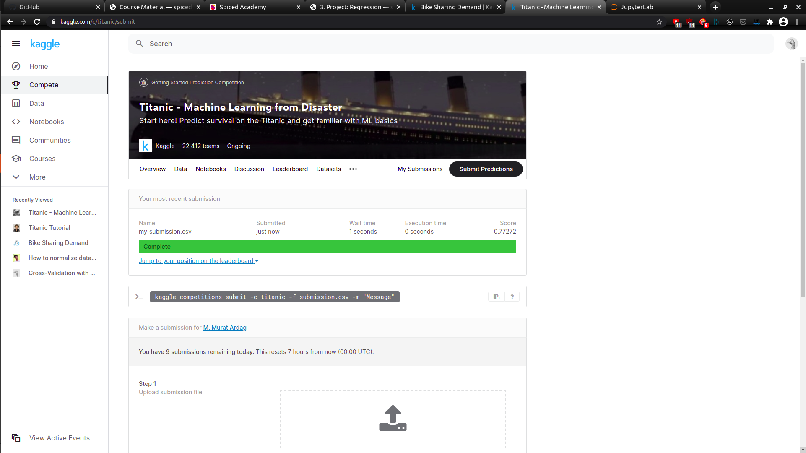

# Week 2 Project:

## Feature Engineering & Classification using the Titanic Challenge on Kaggle

This project was completed in week 2 of the Data Science Bootcamp at Spiced Academy.

Project's notebook is [here](titanic_final_updated.ipynb).

The project involves basic implementation of

- feature engineering

- pipelines

- logistic regression, decision trees and random forests with Python sklearn

With this notebook I got an accuracy score of 0.77272 in the Kaggle Challenge using random forest.

### TO DO later

- change the binning for age (define intervals yourself)
- bin family size with the intervals you define yourself
- (perhaps) add interactions using the most important features

