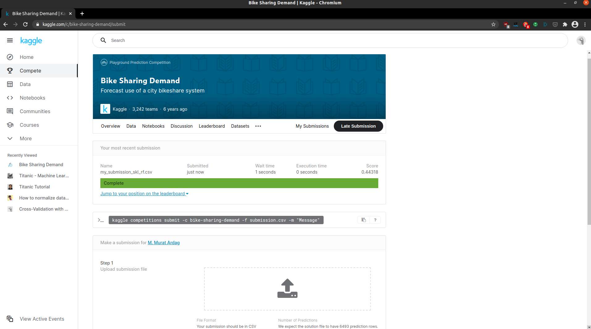
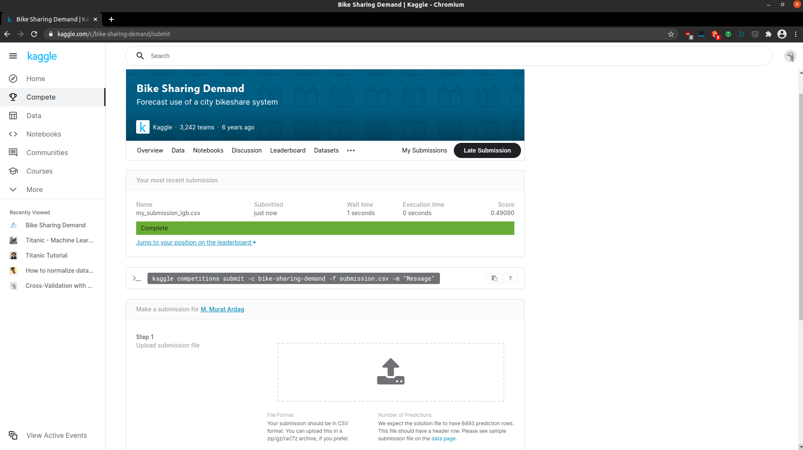

# Week 3 Project:

## Feature Engineering & Regression using the Capital Bikeshare Challenge on Kaggle

This project was completed in week 3 of the Data Science Bootcamp at Spiced Academy.

The project notebook is [here](project_Thu.ipynb).

The project involves basic implementation of
- feature engineering
- pipelines

Project also involves the basic implementation of
  - linear regression
  - poisson regression
  - regression applications with regularization -- ridge, lasso, elasticnet
  - gradient boosting and histogram-based gradient boosting
with ```sklearn``` 
as well as
  - gradient boosting with three other libraries --```XGBoost```,  ```LightGBM``` & ```CatBoost```

Eventually, I ended up making two submissions to Kaggle and got an RMSLE score of .44 with ```sklearn``` & .49 with ```LightGBM```




