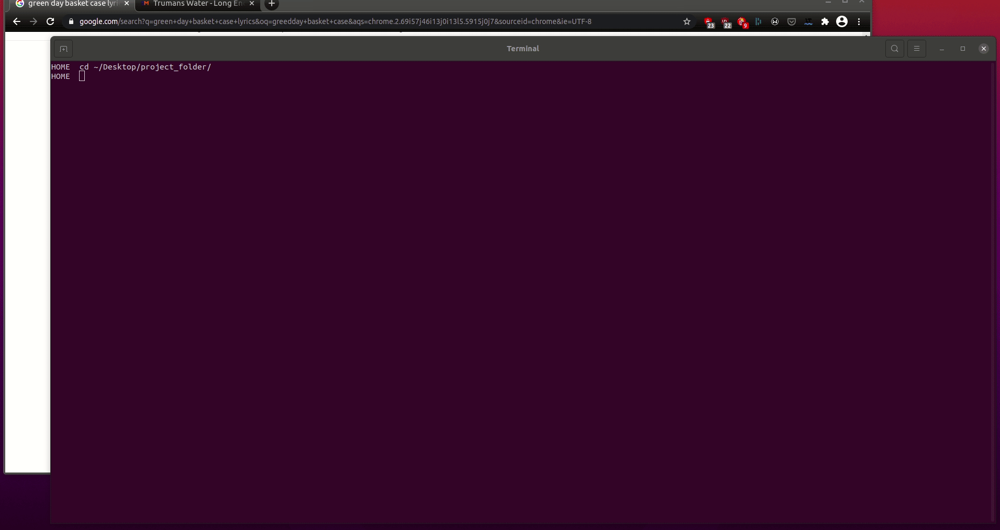

# Week 4 Project:

## Text Classification with Song Lyrics

This project was completed in week 4 of the Data Science Bootcamp at Spiced Academy.

The project involves the basic implementation of
- web-scraping using different Python libraries like``` requests```,  ```re```,  ```BeautifulSoup``` & ```scrapy```
- bag-of-words approaches
- corpus-prep / text pre-processing
- command line interface (CLI) applications using ```argparse``` library

During this week, we also got to work on making Python code modular; something that I need to improve myself on.

For the weekly project, I
- scraped 2146 song lyrics (1049 indie & 1097 punk) by 25 artists
- prepped corpus by
  - lemmatizing with ```spaCy```
  - removing stopwords, using regex to strip off numbers, symbols etc.
  - trimming the corpus
- relied on tf-idf for getting the dfm
- trained a model with RandomForestClassifier

Feel free to navigate the directories or simply access the CLI from [this folder](project_folder).

Below is a screen capture of the CLI.



### TO-DO

- Maybe collect more data and turn the project into a little fun web-application in the long run.

## Acknowledgements

The ```scrapy``` script is kindly provided by  [Paul Wlodkowski](https://github.com/pawlodkowski) and is probably adopted from the repo [here](https://github.com/pawlodkowski/lyrics_scraper).
