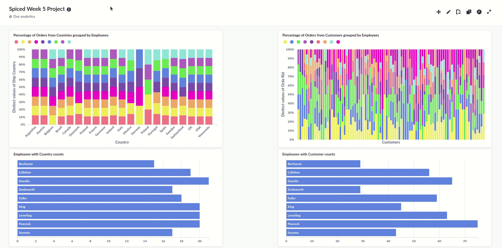

# Week 5 Project:

## Creating a Metabase Dasboard on top of a Postgres database that runs in the AWS cloud

This project was completed in week 5 of the Data Science Bootcamp at Spiced Academy.

The aim of the project was to build a dashboard that is hosted on AWS RDS and EC2.

The database is the famous Northwind Trades -- a fictional company that sells various food products internationally.

I pragmatically focused on the performance of the sales team.

Below is a screen capture of the Metabase dashboard.

Queries used for creating the dashboard are [here](sample_sql.sql)

