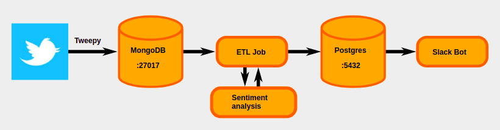
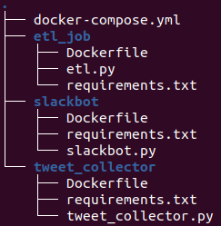

# Week 6 Project:

## Tweet stream data pipeline for a Slackbot

This project was completed in week 6 of the Data Science Bootcamp at Spiced Academy in Berlin.



This is a simple implementation of a dockerized data pipeline that sends randomized tweets about politics together with their sentiment scores.

The Docker-Compose pipeline includes five containers. With the following folder structure the data pipeline...


- collects tweets with the Twitter API and ```tweepy```

- stores the tweets in a MongoDB
- applies an ETL job that
  - extracts the tweets from MongoDB
  - gets the sentiments of the texts with ```VADERSentiment```
- loads the tweets and their sentiment scores in a Postgres database
- creates a Slackbot that post a randomly selected anonymized tweet from the Postgres database into a Slack channel.

Pipeline folder including the docker-compose.yml is [here](docker_compose).