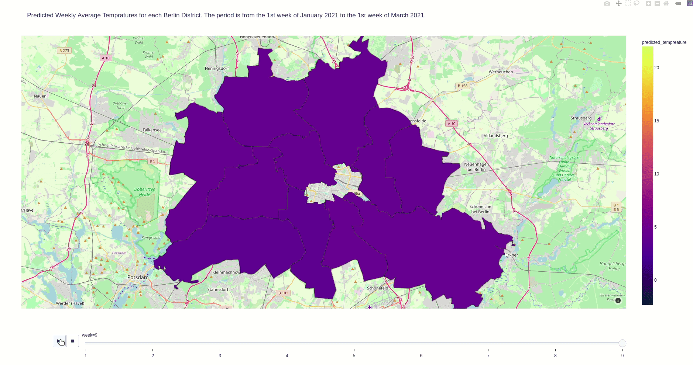

# Week 7 Project:

## Time Series Analysis

This project was completed in week 7 of the Data Science Bootcamp at Spiced Academy in Berlin.

This is a simple implementation of a time series analysis within the Python environment.

My goal was to forecast the weekly average temperature in each Berlin district for the 01 January - 07 March 2021 period.

I pragmatically relied on Facebook ```prophet``` rather than using libraries like ```statmodels``` in combination with ```sklearn```. For the visualization I relied on ```plotly```.

## Disclaimer

The forecast is far from perfect, partially due to the lack of data availability -- for whatever reason Friedrichshain-Kreuzberg data stops around 1960s, so a forecast for the following month does not appear on the map. Also note that for some districts I had to copy the data from the neighboring district or use data coming from a nearby weather station. The forecast is far from perfect also because of my pragmatism and laziness; and surely I'm no weather person who knows this kind of stuff.

## Acknowledgements

Data is from [www.ecad.eu](https://www.ecad.eu/).

Geojson comes from [here](https://github.com/funkeinteraktiv/Berlin-Geodaten).

The ```plotly``` visualization is adopted from [Paul Wlodkowski](https://github.com/pawlodkowski)'s super helpful tutorial that is available [here](https://github.com/pawlodkowski/interactive_climate_map).

See the screen capture below or simply click [here](https://mmuratardag.github.io/berlin_interactive_map.html).



Download the following files to replicate the analysis. There is also a sample data, however I am not allowed to push the data to GitHub due to redistribution of the raw data restrictions.
- [TS_data_prophet_upd.py](TS_data_prophet_upd.py)
- [TS_data_prophet_plotly.py](TS_data_prophet_plotly.py)