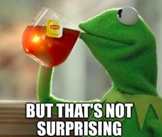

# Week 7 Project:

## Deep Learning

This project was completed in week 9 of the Data Science Bootcamp at Spiced Academy in Berlin.

The project involves a basic implementation of image classification with neural networks.

Utilizing the Fashion MNIST data, I made the classification with two libraries (```keras``` & ```torch```) in two different platforms (Python & R). Using the same network arhitecture, my aim was to see if there is going to be any major differences in accuracy between the  libraries and platforms. The answer is ... meeh... They are all very similar.



Perhaps some .00 something difference or a .1 difference.

The Jupyter Notebooks and R script is below in case anybody wants to test further.

* [keras_Fmnist_cnn.R](keras_Fmnist_cnn.R)
* [pytorch_fMNIST_cnn.ipynb](pytorch_fMNIST_cnn.ipynb)
* [tfK_fMNIST_cnn.ipynb](tfK_fMNIST_cnn.ipynb)